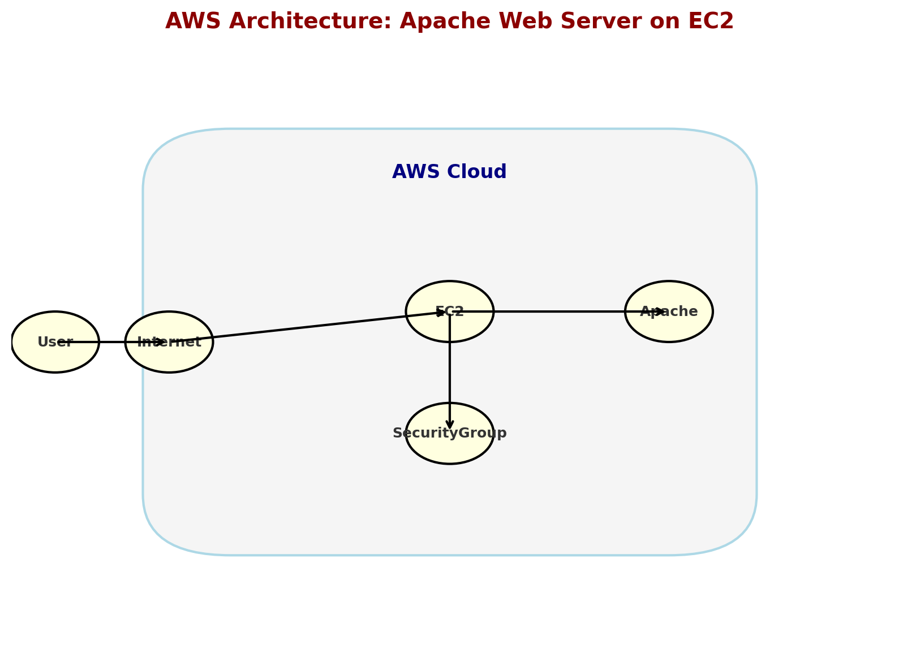

# 🚀 Deploy a Custom Apache Web Server on Amazon EC2

This repository demonstrates how to deploy a **custom Apache (httpd) web server** on an **Amazon Linux 2023 EC2 instance**, automatically configured at launch using **EC2 User Data**. It includes a sample custom webpage and troubleshooting notes from a real run-through.

---

## 📖 Project Overview
- **Cloud Provider:** AWS  
- **Service:** Amazon EC2  
- **OS:** Amazon Linux 2023  
- **Web Server:** Apache (httpd)  
- **Automation:** EC2 User Data (bash script)  
- **Deliverable:** Custom HTML webpage deployed automatically

---

## Architecture Overview


---

## ⚙️ Quick Start (Console)
1. Sign in to the AWS Console → **EC2 → Launch Instance**.  
2. Configure:
   - **Name:** `Custom-Apache-Web-Server`  
   - **AMI:** Amazon Linux 2023  
   

   - **Instance Type:** `t2.micro` (Free Tier eligible)  
   - **Key Pair:** choose as needed (you can use EC2 Instance Connect if not using an SSH key)  
   - **Networking:** Enable **Auto-assign Public IP**  
   - **Security Group (Inbound):**  
     - **SSH (22)** — Source: *your IP*  
     - **HTTP (80)** — Source: `0.0.0.0/0` (allow IPv4 web traffic)  
   - **User Data:** paste the provided user-data script (below)

3. Launch instance, then open `http://<PUBLIC_IPV4>` in your browser.

---

## 🧾 User Data Script (paste into the User Data field)
```bash
#!/bin/bash
# Update package list and install Apache
dnf update -y
dnf install -y httpd

# Start and enable Apache service
systemctl start httpd
systemctl enable httpd

# Set permissions for Apache root directory
chown -R ec2-user:ec2-user /var/www/html

# Create a custom index.html page
cat <<'EOF' > /var/www/html/index.html
<!DOCTYPE html>
<html lang="en">
<head>
    <meta charset="UTF-8">
    <meta name="viewport" content="width=device-width, initial-scale=1.0">
    <title>Welcome to My Custom Apache Server</title>
    <style>
        body {
            font-family: Arial, sans-serif;
            background-color: #f4f4f4;
            text-align: center;
            padding: 50px;
        }
        .container {
            background: white;
            padding: 20px;
            border-radius: 10px;
            box-shadow: 0px 0px 10px rgba(0, 0, 0, 0.1);
            display: inline-block;
        }
        h1 { color: #333; }
        p  { color: #666; }
    </style>
</head>
<body>
    <div class="container">
        <h1>Welcome to My Custom Apache Web Server!</h1>
        <p>Hosted on an Amazon Linux 2023 EC2 Instance.</p>
        <p>This page was deployed automatically using AWS User Data.</p>
    </div>
</body>
</html>
EOF

# Restart Apache to apply changes
systemctl restart httpd
```

---

## ✅ Verify the Web Server
1. In the **EC2 Console → Instances**, select your instance.  
2. Copy the **Public IPv4 address**.  
3. Open in your browser:  

 http://<PUBLIC_IPV4>

4. You should see the custom webpage 🎉  

---

## 🛠 Troubleshooting — Real Issue Encountered & Resolution

### 🔎 Symptom Observed
- Browser could not reach the page.  
- Running `systemctl status httpd` returned:  

 Unit httpd.service could not be found.


### ⚡ Root Causes Identified
- Security Group initially allowed only **SSH (port 22)** (no HTTP rule).  
- The **EC2 User Data** did not run correctly at boot, so Apache was never installed.  

### 📝 Step-by-Step Fix
1. **Add HTTP inbound rule (Console)**  
 - EC2 → Instances → Select instance → **Security** → click **security group name** → **Edit inbound rules** → Add rule:  
   - **Type:** HTTP  
   - **Protocol:** TCP  
   - **Port range:** 80  
   - **Source:** `0.0.0.0/0`  
 - Save rules.  

 *(CLI alternative — requires AWS CLI configured)*:  
 ```bash
 aws ec2 authorize-security-group-ingress \
   --group-id sg-0123456789abcdef0 \
   --protocol tcp \
   --port 80 \
   --cidr 0.0.0.0/0
```

2.  **SSH into the instance (or use EC2 Instance Connect if no key pair)**  
```bash
ssh ec2-user@<PUBLIC_IPV4>
```

3. **Check Apache (httpd) status**
```bash
systemctl status httpd
```


If you see:

Unit httpd.service could not be found.


→ Apache isn’t installed.

4. **Install Apache manually**
```bash
sudo dnf update -y
sudo dnf install -y httpd
```

5. **Start and enable Apache**
```bash
sudo systemctl start httpd
sudo systemctl enable httpd
```

6. **Create or restore the custom index page(Minimal test page)**
```bash
sudo tee /var/www/html/index.html <<'HTML'
<h1>Hello from Apache on EC2 (Amazon Linux 2023)</h1>
HTML
```

Or reapply the full HTML from the User Data script (recommended).

7. **Test locally on the instance**
```bash
curl http://localhost
```

Expect to see the HTML output.

8. **Test from your browser**
```bash
http://<PUBLIC_IPV4>
```

9. **(Optional) Re-run user data script if automation failed**

Check for script saved by cloud-init:
```bash
sudo ls -l /var/lib/cloud/instance/scripts/
```

If you find user-data.txt (or similar), re-run:
```bash
sudo bash /var/lib/cloud/instance/scripts/user-data.txt
```

10. **Check cloud-init logs (for debugging)**
```bash
sudo tail -n 200 /var/log/cloud-init-output.log
sudo tail -n 200 /var/log/cloud-init.log
```


